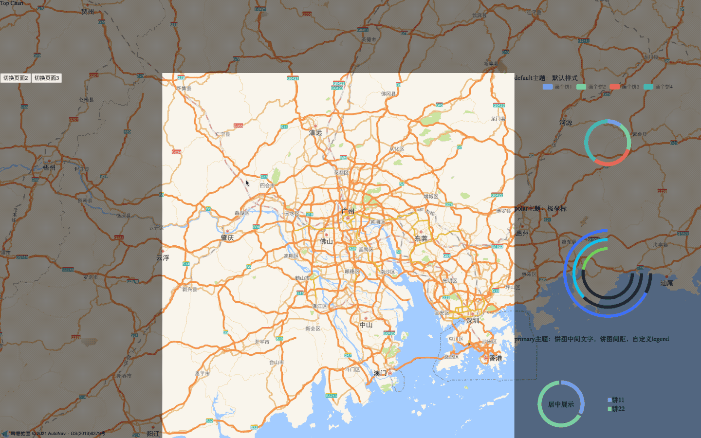

# React-Fast-Map

使用 Map 组件，可以缩短地图引擎的初始化时间。利用单例组件模式，将地图节点缓存下来，在页面或组件频繁切换时，达到略过初始化步骤，无延迟渲染地图的结果。

<br>
Even if the pages switch frequently, the Map Component don't need to wait rendering.

## Basic Usage

### Install

```
npm i react-fast-map
// or
yarn add react-fast-map
```

### 1. Import API file

```javascript
// 1. 在/public/index.html中引入地图api
<head>
  <script
    src="https://webapi.amap.com/maps?v=1.4.15&key=xxxxxxx"
    type="text/javascript"
  ></script>
</head>
```

### 2. Create Initialization Function

```javascript
// 2. 在项目入口文件中定义初始化函数，如/src/index.js 或/src/App.js
import Map from 'react-fast-map';
Map.initialize = () => {
  return {
    // 默认地图
    DEFAULT: trigger => {
      const map = new window.AMap.Map('DEFAULT');
      map.on('complete', () => {
        // 加载完成时，将地图实例回调给组件
        trigger(map);
      });
    },
    // 支持多个地图实例
    PRIMARY: trigger => {
      const map = new window.AMap.Map('PRIMARY');
      map.on('complete', () => {
        trigger(map);
      });
    },
    // SECONDARY: trigger => { ... }
    // ...
  };
};
```

## 3. Render Map Component / Get Map Component Instance

提供了<code>useMap</code>，<code>withMap</code>方法获取地图实例

```javascript
// 3. 在页面中引用实例
import Map from 'react-fast-map';
const { useMap, withMap } = Map;
const Comp1 = props => {
  const [map] = useMap(); // 默认地图 DEFAULT
  const [primary] = useMap('PRIMARY'); // 自定义 id 地图 PRIMARY
  // const secondary = Map.useMap('SECONDARY'); // 更多主题
  return (
    <div>
      <Map></Map>
      {/* <Map mapId="PRIMARY"></Map> */}
      {/* <Map mapId="SECONDARY"></Map> */}
    </div>
  );
};

// 使用 withMap 目前只能获取 DEFAULT 默认地图实例
const Comp2 = withMap(props => {
  const { map } = props;
  return (
    <div>
      <Map></Map>
    </div>
  );
  // ...
});
```
